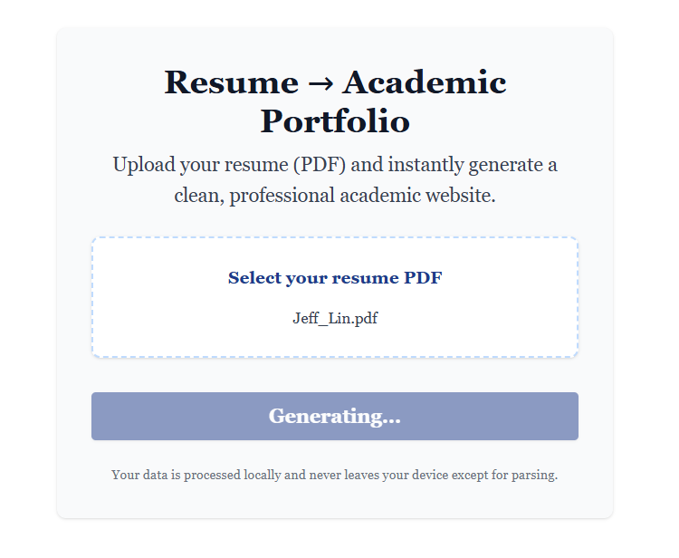

# Resume To Website 

A free, open-source tool that converts PDF resumes into beautiful, professional academic portfolio websites.

## Features

- **PDF Resume Parsing**: Upload any PDF resume and extract structured data
- **AI-Powered Organization**: Uses GPT-4 to intelligently organize and summarize content
- **Academic Template**: Clean, professional design optimized for academic portfolios
- **Responsive Design**: Looks great on desktop, tablet, and mobile
- **JSON Export**: Download your parsed data for further customization
- **Local Processing**: Your data never leaves your device except for AI processing

## How? 

### Upload Your Resume



### Generate An Academic Website


## Project Structure

```
website_generator/
├── src/
│   ├── App.jsx           # Main React application
│   ├── index.css         # Global styles
│   └── main.jsx          # React entry point
├── server.js             # Express backend server
├── package.json          # Dependencies and scripts
├── tailwind.config.cjs   # Tailwind CSS config
├── vite.config.js        # Vite config
├── postcss.config.cjs    # PostCSS config
├── README.md             # This file
└── ...                   # Other config and asset files
```

## Getting Started

1. **Clone the repository:**
   ```bash
   git clone https://github.com/jeffelin/resume_to_website.git
   cd resume_to_website
   ```

2. **Install dependencies:**
   ```bash
   npm install
   ```

3. **Set up environment variables:**
   - Copy `.env.example` to `.env` and fill in your OpenAI API key.

4. **Run the backend server:**
   ```bash
   node server.js
   ```
   This will start the backend API server on [http://localhost:3001](http://localhost:3001).

5. **Run the frontend development server:**
   In a new terminal window/tab, run:
   ```bash
   npm run dev
   ```
   This will start the frontend on [http://localhost:5173](http://localhost:5173).

6. **Open your browser:**
   - Visit [http://localhost:5173](http://localhost:5173) to use the app.

## Benefits 

- **Privacy**: Your resume data stays on your device
- **Instant**: Generate a professional academic website in seconds
- **Clean**: Beautiful, minimalist design perfect for academic portfolios
- **Free**: No watermarks, subscriptions, or hidden costs

## License

MIT License
